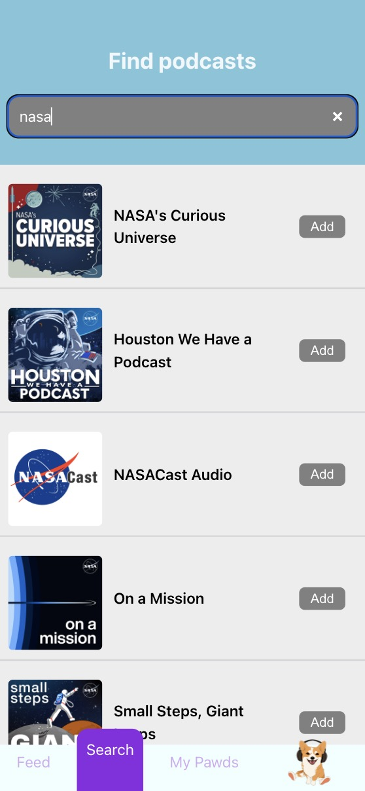
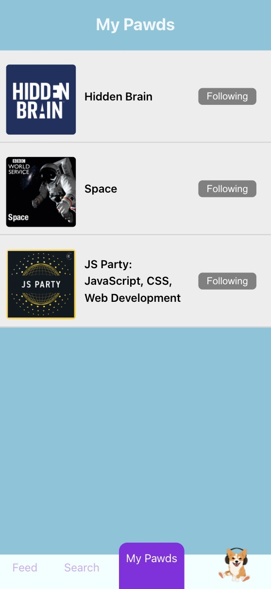
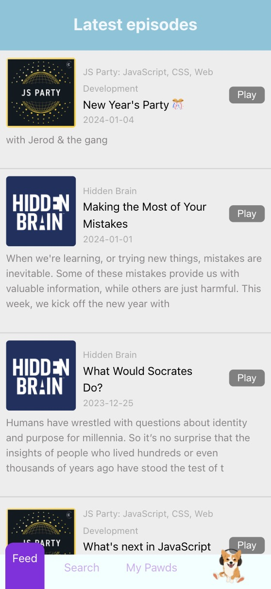

# Pawdcasts app

Web app for finding, following, discovering and listening to Podcasts.

Search across millions of podcasts with Apple Podcast API integration:



Track your favorite podcasts by following them:



See a feed of new episodes from podcasts you follow:



Listen to episodes and discuss them via comments:


## Running locally

```sh
npm run dev --prefix client
python -m server.app
```

OR

```sh
honcho start -f Procfile.dev
```

## Deploying to heroku

```sh
git push heroku main:master
```
